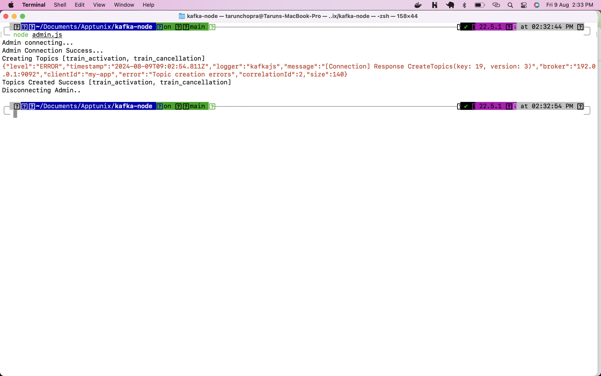
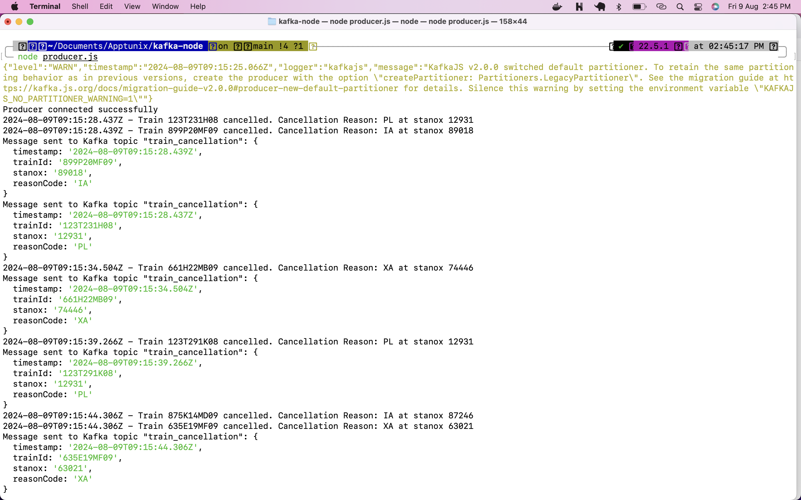
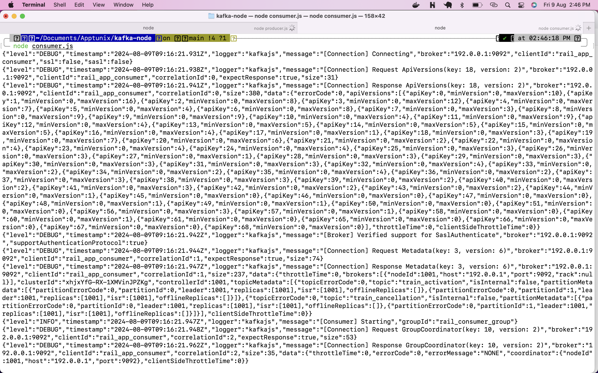
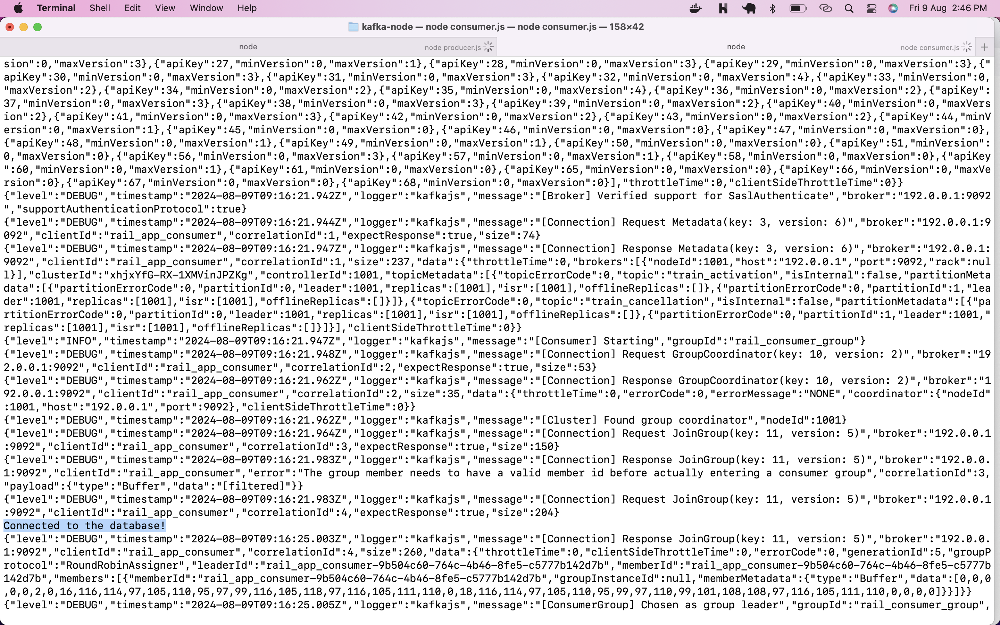
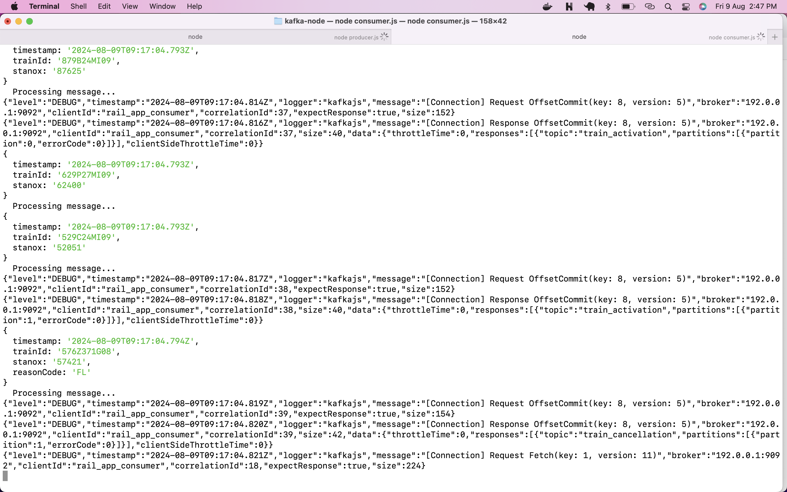
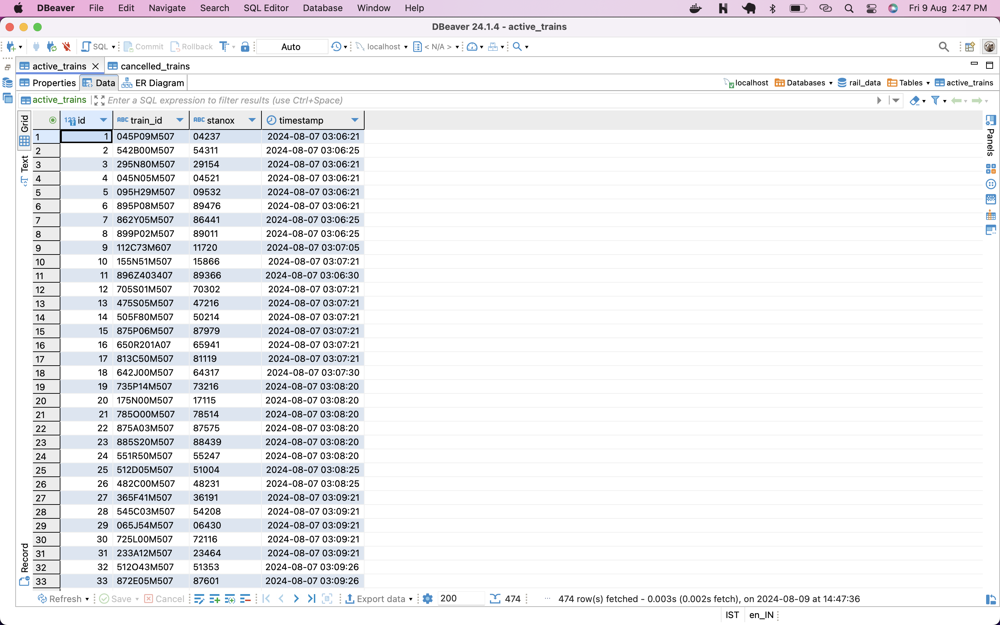
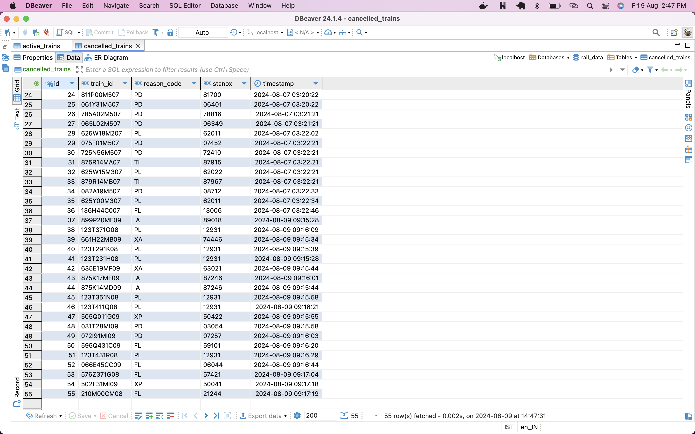

# Integration of Apache Kafka with Node.js 
## To handle railway data, with a MySQL database for storing the processed information.

### Screenshots










### **1. Setting Up Kafka and Zookeeper with Docker**
The two Docker commands you ran are used to start Zookeeper and Kafka, which are the backbone of this system:

- **Zookeeper**: Acts as a coordinator for Kafka. It manages the Kafka brokers and helps keep track of the status of Kafka nodes.
  
  ```bash
  docker run -p 2181:2181 zookeeper
  ```

- **Kafka Broker**: Handles the actual message storage and delivery. The `KAFKA_ZOOKEEPER_CONNECT` environment variable links Kafka to Zookeeper, while `KAFKA_ADVERTISED_LISTENERS` sets the address Kafka will use.

  ```bash
  docker run -p 9092:9092 -e KAFKA_ZOOKEEPER_CONNECT=192.0.0.1:2181 -e KAFKA_ADVERTISED_LISTENERS=PLAINTEXT://192.0.0.1:9092 -e KAFKA_OFFSETS_TOPIC_REPLICATION_FACTOR=1 confluentinc/cp-kafka
  ```

### **2. Kafka Client Configuration**
In both `client.js` and `admin.js`, you create a Kafka client using the `kafkajs` library. This client is essential for both producing and consuming messages in Kafka.

```javascript
const { Kafka } = require("kafkajs");

exports.kafka = new Kafka({
  clientId: "my-app",
  brokers: ["192.0.0.1:9092"],
});
```

### **3. Managing Kafka Topics with Admin.js**
`admin.js` is responsible for setting up the Kafka topics where messages will be published. Topics are like channels that allow producers to send messages to consumers.

- **Connecting to Kafka**: It uses the Kafka client to establish a connection.
- **Creating Topics**: `train_activation` and `train_cancellation` topics are created to handle specific types of messages.
- **Disconnecting**: Once the topics are created, it disconnects from Kafka to free up resources.

```javascript
async function init() {
  const admin = exports.kafka.admin();
  console.log("Admin connecting...");
  await admin.connect();
  // Topic creation code...
  await admin.disconnect();
}
```

### **4. Producing Messages with Producer.js**
This file handles the production of messages, sending data related to train activations and cancellations to the appropriate Kafka topics.

- **Kafka Producer Initialization**: It sets up the Kafka producer to send messages.
- **STOMP Connection**: It connects to an external data feed using the STOMP protocol. This is where it receives real-time train movement data from a public API.
- **Message Handling**: Upon receiving a message, it checks the type (`train_activation` or `train_cancellation`), processes the data, and sends it to Kafka.

```javascript
client.subscribe(headers, (error, message) => {
  // Process message and send to Kafka
});
```

### **5. Consuming Messages with Consumer.js**
This file sets up a Kafka consumer to listen for messages on the `train_activation` and `train_cancellation` topics.

- **Kafka Consumer Initialization**: It subscribes to the topics created earlier and starts listening for messages.
- **Processing Messages**: Each message received is logged and then processed. Depending on the topic, it inserts the data into MySQL.

```javascript
await kafkaConsumer.run({
  eachMessage: async ({ topic, partition, message }) => {
    // Process and store message in MySQL
  },
});
```

### **6. Storing Data in MySQL**
The processed messages are stored in a MySQL database:

- **MySQL Pool**: A connection pool is created for efficient database interactions.
- **Insertion Functions**: `insertActiveTrain` and `insertCancelledTrain` handle inserting data into the `active_trains` and `cancelled_trains` tables respectively.

```javascript
function insertActiveTrain(trainId, stanox, timestamp) {
  // Insert train activation data into the database
}
```

### **7. Graceful Shutdown**
Finally, there are handlers to ensure that the Kafka consumer disconnects gracefully when the process is terminated.

```javascript
process.on("SIGTERM", async () => {
  await kafkaConsumer.disconnect();
  process.exit(0);
});
```

### **How It All Ties Together**
Imagine a railway system where you need to keep track of trains: when they start and when they get canceled. This system listens to live data feeds about trains, processes that information, and uses Kafka to manage the flow of data between different components. Kafka acts like a message bus, ensuring that every piece of data gets where it needs to go—whether that’s storing it in a database or triggering other actions based on the data.